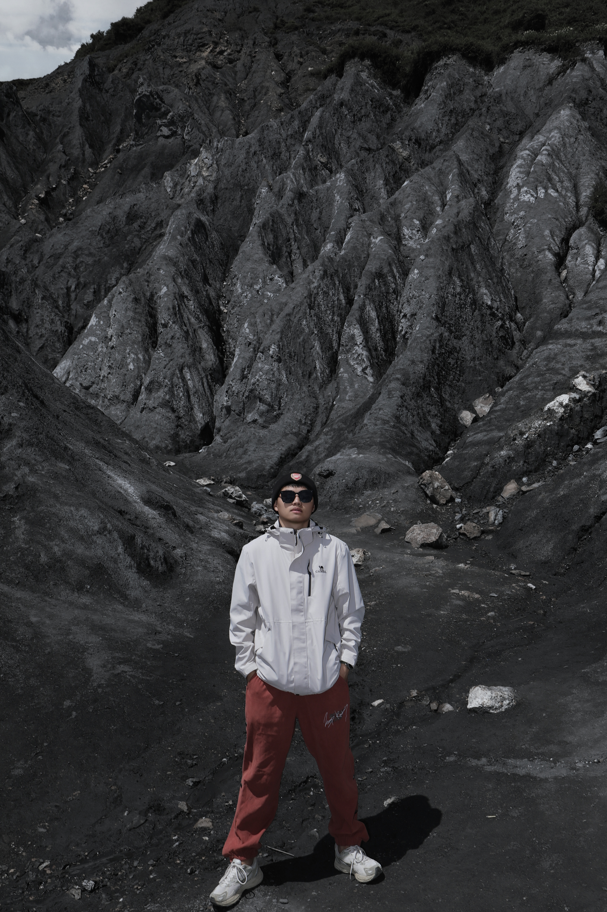

  <!-- dynamic typing effect 动态打字效果 -->
  
  [;HappyEveryDay!&center=true&size=27)](https://git.io/typing-svg)

  <!-- knock code pictures 敲代码的图片 -->
  <picture>
    <source media="(prefers-color-scheme: dark)" srcset="https://cdn.jsdelivr.net/gh/sun0225SUN/sun0225SUN/assets/images/coding.gif" />
    <source media="(prefers-color-scheme: light)" srcset="https://cdn.jsdelivr.net/gh/sun0225SUN/sun0225SUN/assets/images/developer.svg" height="225px" />
    
  </picture>

  <!-- for beauty 留个空行好看点 -->
  
&nbsp;

  <!-- profile logo 个人资料徽标 -->
  

    &emsp;
    &emsp;
    &emsp;

  

  <!-- Snake Code Contribution Map 贪吃蛇代码贡献图 -->
  <picture>
    <source media="(prefers-color-scheme: dark)" srcset="https://cdn.jsdelivr.net/gh/lzypython/lzypython/profile-snake-contrib/github-contribution-grid-snake-dark.svg" />
    <source media="(prefers-color-scheme: light)" srcset="https://cdn.jsdelivr.net/gh/lzypython/lzypython/profile-snake-contrib/github-contribution-grid-snake.svg" />
    
  </picture>

#  🙋 Hello

<table>
### 🤺 About Me
<tr><td>

Hi everyone, I'm Li Zhiyang, currently a first-year graduate student at the University of Science and Technology of China, focusing on Multimodal AI, Large Language Models, and RAG research. You can find my published papers on my <a href="https://scholar.google.com/citations?user=qJpBakEAAAAJ&hl=zh-CN" target="_blank">Google Scholar</a> profile.

I'm passionate about programming, cycling, and traveling. I'm currently learning swimming and hope to master breaststroke by the end of this year.

I pursue work-life balance, which I believe is both an aspiration and a capability.

<strong>I hope to become an outstanding developer in the future while still maintaining a full head of hair.</strong>

</td></tr>

<tr><td>

</td></tr>

<tr><td>

</td></tr>

</table>

<!-- ########################################## 分割 ########################################## -->

<!-- GitHub Activity Graph GitHub 活动图 -->
<table>
  <tr>
    <td>
      <picture>
        <source media="(prefers-color-scheme: dark)" srcset="https://github-readme-activity-graph.vercel.app/graph?username=lzypython&theme=xcode&bg_color=FF000000&hide_border=true" />
        <source media="(prefers-color-scheme: light)" srcset="https://github-readme-activity-graph.vercel.app/graph?username=lzypython&theme=xcode&bg_color=FF000000&color=000000&hide_border=true" />
        
      </picture>
  </tr>
</table>

<!-- ########################################## 分割 ########################################## -->

<!-- profile-3d-contrib 3D 贡献图-->
<picture>
  <source media="(prefers-color-scheme: dark)" srcset="profile-3d-contrib/profile-night-rainbow.svg" />
  <source media="(prefers-color-scheme: light)" srcset="profile-3d-contrib/profile-green-animate.svg" />
  
</picture>

### 📃 Annual Summary

<!-- feed start -->
- Jan 26 - [2024年度总结——理想的风，吹进现实](https://lizhiyang.blog.csdn.net/article/details/145319862)
- Jan 28 - [2023年度总结——忙忙碌碌，终有归章](https://lizhiyang.blog.csdn.net/article/details/135893193)
- Jan 10 - [2022年度总结——一切都在慢慢变好](https://lizhiyang.blog.csdn.net/article/details/128625661)
<!-- feed end -->
